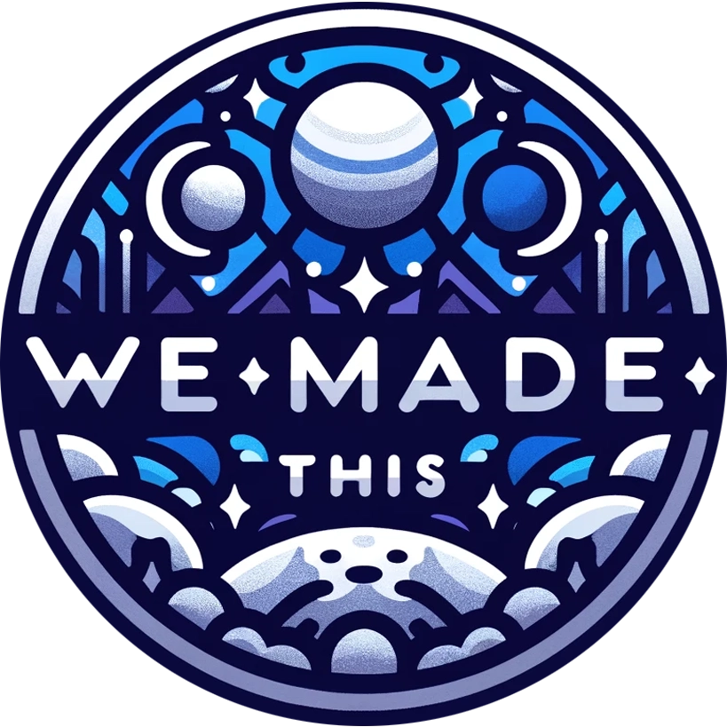

# Collaborative D&D Worldbuilding Tool

Welcome to the Collaborative D&D Worldbuilding Tool! This project aims to assist Dungeon Masters (DMs) and their players in collaboratively creating and documenting a unique Dungeons & Dragons (D&D) world. By leveraging AI, this tool helps users generate original content while managing the tedious aspects of documentation and organization.

## Table of Contents

- [Introduction](#introduction)
- [Features](#features)
- [How It Works](#how-it-works)

## Introduction

As a DM, I needed a new world for our D&D campaign and wanted it to be a collaborative effort with my players. The goal was to create a world grounded in our imaginations and the canon we develop, without the burden of extensive documentation. This tool flips the typical use case of Large Language Models (LLMs) from generating content to assisting users in creating original content, while handling the documentation and organization.

## Features

- **Interactive Chat**: Role-play as characters within a fictional world through a series of chats.
- **AI Interviews**: The AI conducts interviews, extracting detailed information about the world from the users' responses.
- **Fact Extraction**: The AI identifies and extracts key "facts" from the interviews, perfect for context building and use with embeddings.
- **Dynamic Wiki**: The system updates a wiki and its associated taxonomy in real-time, providing a centralized overview of the world's information.
- **Consistency Checks**: The AI enhances its interviewing capabilities by challenging inconsistencies and asking questions grounded in the developing lore.

## How It Works

1. **Chat Agent**: Engages users in role-playing chats and queries contextually relevant information.
2. **Fact Agent**: Extracts key facts and glossary terms from the chat transcripts, building the base lore.
3. **Wiki Agent**: Updates the wiki with new information, ensuring the documentation reflects the evolving world.

### Example Fact
- "Worbor Bank employs paladins to enforce debt collection."